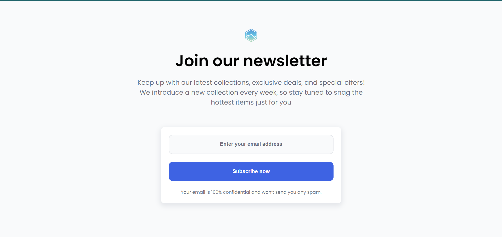

# Join Our Newsletter

Este proyecto es una página web sencilla diseñada para permitir a los usuarios suscribirse a un boletín informativo. Proporciona un formulario donde los usuarios pueden ingresar su dirección de correo electrónico para recibir actualizaciones sobre colecciones, ofertas exclusivas y novedades.

## Vista Previa



Puedes ver la versión demo en vivo aquí: [Join Our Newsletter](https://ibrahim-003.github.io/Simple-Newsletter/)

## Características

- **Responsiva:** La página está optimizada para adaptarse a diferentes tamaños de pantalla, mejorando la experiencia de usuario en dispositivos móviles y de escritorio.
- **Estilo moderno:** Utiliza la fuente "Poppins" para un diseño atractivo y contemporáneo.
- **Formulario funcional:** Permite a los usuarios ingresar su correo electrónico para suscribirse, con un mensaje de confidencialidad para garantizar la privacidad.
- **Estructura semántica:** La página está construida con etiquetas HTML semánticas que mejoran la accesibilidad.

## Estructura de Archivos

```
|-- index.html         # Página principal
|-- css/
    |-- reset.css      # Reseteo de estilos predeterminados del navegador
    |-- styles.css     # Estilos personalizados de la página
|-- images/
    |-- logo-newsletter.svg  # Logo de la newsletter
```

## Instalación

1. Clona este repositorio en tu máquina local.
   ```bash
   git clone https://github.com/Ibrahim-003/Simple-Newsletter.git
   ```
2. Asegúrate de que tienes conexión a Internet para cargar las fuentes de Google Fonts y los estilos CSS.
3. Abre `index.html` en tu navegador para ver la página.

## Uso

La página se puede personalizar fácilmente ajustando los estilos en el archivo `styles.css` y modificando el contenido en el archivo `index.html`. Puedes agregar más elementos o secciones según tus necesidades.

## Tecnologías Utilizadas

- HTML5
- CSS3
- Google Fonts

## Autor

Este proyecto fue creado por [Ibrahim Almeyda].
